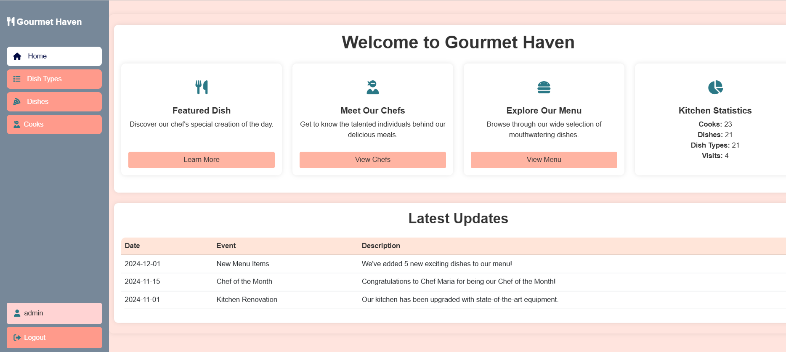

# 🍽️ Restaurant Kitchen Management System

A Django-powered web application designed to simplify kitchen management processes in restaurants.

---

## 🌐 Live Demo

The application is deployed and available at: [https://restaurant-kitchen-mitq.onrender.com](https://restaurant-kitchen-mitq.onrender.com)

You can test the application using these demo credentials:

Preview of the application interface:


- **Login:** test
- **Password:** Test123123

## 📋 Table of Contents
- [🌐 Overview](#-overview)
- [✨ Features](#-features)
- [💻 System Requirements](#-system-requirements)
- [🔧 Environment Variables](#-environment-variables)
- [🚀 Installation](#-installation)
  - [Local Setup](#local-setup)
- [📁 Project Structure](#-project-structure)
- [📚 API Documentation](#-api-documentation)
- [🧪 Testing](#-testing)
- [🤝 Contributing](#-contributing)
- [📄 License](#-license)

---

## 🌐 Overview

Restaurant Kitchen Management System is a Django-powered application that simplifies kitchen management processes by providing functionality for managing dishes, chefs, and dish types. The application also supports user authentication and personalized dish assignments.

---

## ✨ Features

- 📊 **Kitchen Statistics:** View key kitchen metrics on the main dashboard.
- 🍽️ **Dish Management:** Create, view, update, and delete dishes.
- 🍳 **Dish Type Management:** Manage various types of dishes.
- 👨‍🍳 **Chef Management:** Add, view, update, and remove chefs.
- 🔄 **User Assignment:** Assign/unassign yourself to dishes.
- 🔒 **Authentication:** Login and logout functionality with secure access control.

---

## 💻 System Requirements

- **Python**: 3.11 or newer
- **PostgreSQL**: 14 or newer
- **Operating System**: Compatible with Linux, macOS, and Windows

---

## 🔧 Environment Variables

The project requires the following environment variables in a `.env` file in the root directory:

- Create a .env file following the .env.sample template and replace with your values.
- Ensure that the .env file is not included in your version control system (e.g., Git) as it contains sensitive information.

---

## 🚀 Installation

### Local Setup

1. Clone the repository:
   ```bash
   git clone https://github.com/mshmygel/restaurant-kitchen.git
   cd restaurant_kitchen
   ```

2. Create and activate a virtual environment:
   - Linux/Mac:
     ```bash
     python3 -m venv venv
     source venv/bin/activate
     ```
   - Windows:
     ```bash
     python -m venv venv
     venv\Scripts\activate
     ```

3. Install dependencies:
   ```bash
   pip install -r requirements.txt
   ```

4. Apply database migrations:
   ```bash
   python manage.py migrate
   ```
   
5. Load sample data (optional): If you want to preload the database with test data:
    ```bash
   python manage.py loaddata test_data.json
    ```

6. Create a superuser:
   ```bash
   python manage.py createsuperuser
   ```

7. Run the development server:
   ```bash
   python manage.py runserver
   ```

8. Access the application at:
   - [http://127.0.0.1:8000](http://127.0.0.1:8000)

---

## 📁 Project Structure

- `accounts/`: Handles user management, including chefs and authentication.
- `kitchen/`: Manages dishes, dish types, and kitchen statistics.
- `templates/`: HTML templates for the frontend.
- `static/`: Static files (CSS, JavaScript, images).

---

## 📚 API Documentation

### Key Models
- **Cook**: Represents a chef in the kitchen.
- **Dish**: Represents a dish with details like name, type, price, and assigned chefs.
- **DishType**: Represents a category for dishes.

### Key Views
- **Kitchen Views**:
  - `IndexView`: Displays kitchen statistics.
  - `DishListView`: Lists all dishes with search functionality.
  - `DishDetailView`: Shows detailed information about a dish.
  - `ToggleAssignToDishView`: Allows chefs to assign/unassign themselves to a dish.
- **Accounts Views**:
  - `CookListView`: Lists all chefs.
  - `CookDetailView`: Shows detailed information about a chef.

---

## 🧪 Testing

Run automated tests using:
```bash
python manage.py test
```

---

## 🤝 Contributing

Contributions are welcome! Please fork the repository and submit a pull request.

---

## 📄 License

This project is open source and available under the [MIT License](LICENSE).
